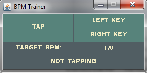

Java applet to test an Osu! player's ability to stream. 
It records the beats per minute in eigth notes that the player is able to tap using two keys.

[Download](https://www.mediafire.com/file/4i1ndcqbdyzei7a/bpmtrainer-1.0.jar/file)
<h1>GG</h1>
Applet Home

Press key buttons to select controls

Choose controls

Click on the target BPM speed that is displayed to edit it

While hovering over the TAP button, tap either or both of the selected keys to increase recorded "BPM" speed

